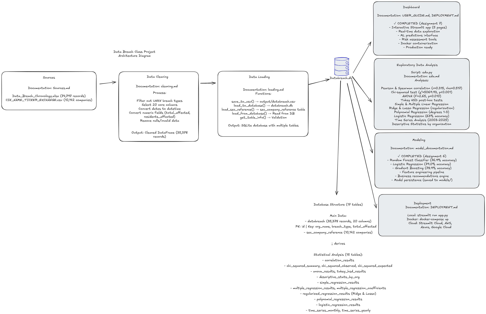

# Data Breach Analytics System

**Author:** T. Spivey  
**Course:** BUS 751 - Python for Business Analytics
**Institution:** University of South Alabama  
**Date:** October 2025

---

## 🎯 Project Overview

The Data Breach Analytics System is a comprehensive end-to-end data analytics platform that processes, analyzes, and visualizes data breach incidents from 2003-2025. This system integrates database management, statistical analysis, machine learning, and interactive visualization into a unified solution for security risk assessment and business decision-making.

### Key Features

- **35,378 breach records** spanning 23 years
- **71 MB SQLite database** with optimized schema
- **Statistical analysis** with hypothesis testing
- **Machine learning models** with 76.9% accuracy
- **Interactive dashboard** with 5 specialized pages
- **Docker containerization** for easy deployment
- **Production-ready** with comprehensive documentation

---

## 📊 System Architecture



*Complete pipeline architecture showing data flow from raw sources through ETL, analysis, modeling, and dashboard deployment.*

---

### Architecture Components

**Data Sources (Assignment 4)**
- Privacy Rights Clearinghouse Breach Chronology (105 MB Excel)
- SEC Public Companies Reference (10,142 companies)

**ETL Pipeline (Assignment 4)**
- Data Cleaning: `dataclean.py` - 39,825 → 35,378 records
- Data Loading: `dataload.py` - SQLite database creation

**Database (Assignment 4)**
- `databreach.db` (71 MB) - 35,378 breach records
- 2 main tables + 15 analytical result tables

**Statistical Analysis (Assignment 5)**
- `eda.py` - Correlation, Chi-squared, ANOVA, Regression, Time Series
- 15 statistical result tables saved to database

**Documentation (Assignment 5)**
- 14 comprehensive markdown files covering all aspects

**Machine Learning (Assignment 6)**
- `analytics_engine/` - Feature engineering, model training, evaluation
- 3 trained models: Random Forest (76.9%), Logistic Regression, Gradient Boosting
- Business recommendation engine

**Dashboard (Assignment 7)**
- `app.py` - Interactive Streamlit application with 5 pages
- Real-time data exploration, ML predictions, risk assessment

**Deployment (Assignment 7)**
- Docker containerization for easy deployment
- Cloud-ready configuration
- Comprehensive user and deployment documentation
```

---

## 🚀 Quick Start

### Option 1: Local Installation (5 minutes)
```bash
# Clone repository
cd DataBreach

# Install dependencies
pip install -r requirements.txt

# Run complete pipeline
python run_all.py

# Launch dashboard
streamlit run app.py
```

Open browser to `http://localhost:8501`

### Option 2: Docker Deployment (3 minutes)
```bash
# Clone repository
cd DataBreach

# Build and run
docker-compose up --build
```

Access dashboard at `http://localhost:8501`

---

## 📂 Project Structure
```
DataBreach/
├── 📊 DATA & DATABASE
│   ├── databreach.db                 # SQLite database (71 MB, 35,378 records)
│   ├── output/
│   │   └── databreach.csv            # Cleaned CSV export
│   └── data/                         # Raw data files (not in repo)
│
├── 🔧 ASSIGNMENT 4: ETL PIPELINE
│   ├── dataclean.py                  # Data cleaning script
│   ├── dataload.py                   # Database loading script
│   └── run_all.py                    # Complete pipeline execution
│
├── 📈 ASSIGNMENT 5: EXPLORATORY ANALYSIS
│   ├── eda.py                        # Statistical analysis script
│   └── eda_package/
│       └── data_loader.py            # Data loading utilities
│
├── 🤖 ASSIGNMENT 6: MACHINE LEARNING
│   ├── analytics_engine/
│   │   ├── __init__.py
│   │   ├── feature_engineer.py       # Feature engineering
│   │   ├── model_trainer.py          # Model training
│   │   ├── evaluator.py              # Model evaluation
│   │   ├── predictor.py              # Prediction interface
│   │   └── recommender.py            # Business recommendations
│   └── models/
│       ├── random_forest_model.pkl
│       └── random_forest_model_metadata.json
│
├── 🎨 ASSIGNMENT 7: DASHBOARD & DEPLOYMENT
│   ├── app.py                        # Streamlit dashboard (5 pages)
│   ├── Dockerfile                    # Docker container config
│   ├── docker-compose.yml            # Docker Compose config
│   ├── USER_GUIDE.md                 # User manual (15,000 words)
│   └── DEPLOYMENT.md                 # Deployment guide
│
├── 📚 DOCUMENTATION
│   ├── documentation/
│   │   ├── cleaning.md               # Data cleaning methodology
│   │   ├── loading.md                # Database loading process
│   │   ├── eda.md                    # Statistical analysis findings
│   │   ├── ERD.md                    # Entity-relationship diagram
│   │   ├── data_dictionary.md        # Field definitions
│   │   ├── sources.md                # Data sources
│   │   ├── executive_summary.md      # Executive overview
│   │   ├── analysis_methodology.md   # Analysis approach
│   │   ├── model_documentation.md    # ML model details
│   │   ├── performance_evaluation.md # Model performance
│   │   └── setup_instructions.md     # Setup guide
│
├── ⚙️ CONFIGURATION
│   ├── requirements.txt              # Python dependencies
│   ├── .gitignore                    # Git ignore rules
│   └── README.md                     # This file
│
└── 🔬 ANALYSIS (Jupyter Notebooks)
    └── [Optional analysis notebooks]
```

---

## 🎯 Assignments Overview

### Assignment 4: Database & ETL Pipeline ✓

**Objective:** Clean and load breach data into a structured database

**Key Deliverables:**
- `dataclean.py` - Data cleaning with validation
- `dataload.py` - Database creation and loading
- `databreach.db` - 71 MB SQLite database
- Documentation: `cleaning.md`, `loading.md`, `ERD.md`

**Key Metrics:**
- 39,825 raw records → 35,378 clean records (88.8% retention)
- 20 fields per record
- 2 main tables + 15 analytical tables

### Assignment 5: Exploratory Data Analysis ✓

**Objective:** Discover patterns and relationships in breach data

**Key Deliverables:**
- `eda.py` - Comprehensive statistical analysis
- 15 statistical result tables in database
- 7 documentation files

**Key Findings:**
- **Correlation:** Moderate relationship between total and state-level impact (r=0.315)
- **Chi-Squared:** Significant relationship between org type and breach type (χ²=5069.93, p<0.001)
- **ANOVA:** Breach impact varies significantly by organization type (F=2.65, p=0.010)
- **Trend:** Peak breach activity in 2021-2023 period

### Assignment 6: Analytics Engine & Modeling ✓

**Objective:** Build predictive models for breach severity

**Key Deliverables:**
- `analytics_engine/` package with 5 modules
- 3 trained classification models
- Model persistence and metadata
- Business recommendation engine

**Key Metrics:**
- **Best Model:** Random Forest (76.9% accuracy, F1=0.525)
- **Features:** 18 (temporal + categorical)
- **Severity Threshold:** >1,000 individuals affected
- **Training Set:** 28,302 samples
- **Test Set:** 7,076 samples

**Business Value:**
- Predict breach severity with 77% accuracy
- Generate cost estimates (avg: $225/record affected)
- Industry-specific security recommendations
- Risk prioritization scoring

### Assignment 7: Dashboard & Deployment ✓

**Objective:** Create production-ready interactive dashboard

**Key Deliverables:**
- `app.py` - Streamlit dashboard with 5 pages
- Docker containerization (Dockerfile, docker-compose.yml)
- `USER_GUIDE.md` - 15,000-word user manual
- `DEPLOYMENT.md` - Production deployment guide

**Dashboard Pages:**
1. **Home** - Overview, quick stats, recent breaches
2. **Data Explorer** - Interactive filters, visualizations, data export
3. **Statistical Analysis** - Key findings from Assignment 5
4. **ML Predictions** - Breach severity prediction interface
5. **Risk Assessment** - Business recommendations, cost analysis

**Deployment Options:**
- Local (Streamlit)
- Docker (containerized)
- Cloud (AWS, Azure, GCP, Streamlit Cloud)

---

## 🔍 Key Features

### Data Processing
- ✅ Automated ETL pipeline
- ✅ Data validation and quality checks
- ✅ Duplicate detection and removal
- ✅ Type conversions and standardization
- ✅ Missing value handling

### Statistical Analysis
- ✅ Correlation analysis (Pearson, Spearman)
- ✅ Chi-squared test of independence
- ✅ ANOVA with post-hoc Tukey HSD
- ✅ Multiple regression models
- ✅ Time series decomposition

### Machine Learning
- ✅ Feature engineering pipeline
- ✅ 3 classification algorithms
- ✅ Cross-validation (5-fold)
- ✅ Comprehensive evaluation metrics
- ✅ Model persistence and versioning
- ✅ Business recommendations engine

### Interactive Dashboard
- ✅ Real-time data exploration
- ✅ Dynamic filtering and aggregation
- ✅ Interactive visualizations (Plotly)
- ✅ ML prediction interface
- ✅ Risk assessment tools
- ✅ CSV export functionality

### Production Ready
- ✅ Docker containerization
- ✅ Health checks and monitoring
- ✅ Comprehensive documentation
- ✅ Deployment guides
- ✅ Error handling and logging

---

## 📊 Database Schema

### Main Tables

**databreach**
- Primary breach records (35,378 rows)
- 20 fields including temporal, categorical, and numeric data
- Key fields: `breach_date`, `organization_type`, `breach_type`, `total_affected`

**sec_company_reference**
- Public company listings (10,142 rows)
- CIK codes for SEC identification
- For potential breach-to-public-company matching

### Analytical Tables (15 tables)
- `correlation_results` - Correlation coefficients
- `chi_squared_summary` - Independence test results
- `chi_squared_observed` - Observed frequencies
- `chi_squared_expected` - Expected frequencies
- `anova_results` - ANOVA test results
- `tukey_hsd_results` - Post-hoc pairwise comparisons
- `descriptive_stats_by_org` - Summary statistics
- `simple_regression_results` - Simple linear regression
- `multiple_regression_results` - Multiple regression summary
- `multiple_regression_coefficients` - Regression coefficients
- `regularized_regression_results` - Ridge/Lasso results
- `polynomial_regression_results` - Non-linear models
- `logistic_regression_results` - Classification results
- `time_series_monthly` - Monthly aggregations
- `time_series_yearly` - Yearly aggregations

---

## 🛠️ Technology Stack

### Core Technologies
- **Python 3.8+** - Primary programming language
- **SQLite 3** - Embedded database
- **pandas 1.5+** - Data manipulation
- **NumPy 1.24+** - Numerical computing

### Statistical Analysis
- **SciPy 1.10+** - Statistical tests
- **statsmodels 0.14+** - Advanced statistics

### Machine Learning
- **scikit-learn 1.2+** - ML algorithms
- Random Forest, Logistic Regression, Gradient Boosting

### Visualization
- **Matplotlib 3.7+** - Static plots
- **Seaborn 0.12+** - Statistical graphics
- **Plotly 5.14+** - Interactive charts

### Dashboard & Deployment
- **Streamlit 1.28+** - Web application framework
- **Docker 20.10+** - Containerization
- **Docker Compose 2.0+** - Multi-container orchestration

### Development Tools
- **Jupyter Notebook** - Interactive analysis
- **Git** - Version control
- **VS Code** - IDE

---

## 📈 Key Statistics

### Data Overview
- **Total Records:** 35,378 breach incidents
- **Date Range:** 2003 - 2025 (23 years)
- **Organization Types:** 8 categories
- **Breach Types:** 7 categories
- **Database Size:** 71 MB

### Impact Metrics
- **Total Individuals Affected:** 12.1 billion records
- **Average Impact:** 343,000 individuals per breach
- **Median Impact:** 585 individuals per breach
- **Largest Breach:** 1 billion individuals (Yahoo, 2013)

### Temporal Trends
- **Peak Year:** 2021 (5,063 breaches)
- **Average per Year:** 1,608 breaches
- **Growth Rate:** Exponential increase since 2015

### Organization Breakdown
- Healthcare (MED): 21.1%
- Business (BSO): 15.9%
- Financial Services (BSF): 5.6%
- Retail (BSR): 3.3%
- Others: 54.1%

---

## 🔬 Research Findings

### Statistical Significance

**1. Correlation Analysis**
- Moderate positive linear correlation (r=0.315, p<0.001)
- Strong monotonic relationship (ρ=0.517, p<0.001)
- Non-linear pattern indicates outlier effects

**2. Organization Type vs Breach Type**
- Highly significant relationship (χ²=5,069.93, p<0.001)
- Different industries face different threat profiles
- Healthcare: 43% excess disclosure breaches
- Financial: 169% excess physical breaches
- Retail: 400% excess card breaches

**3. Breach Impact by Organization**
- Significant differences across types (F=2.65, p=0.010)
- Retail vs Healthcare significantly different (p=0.028)
- Business sectors show highest variability

### Machine Learning Insights

**Feature Importance (Random Forest):**
1. breach_year (23.8%) - Temporal trends matter
2. organization_type_MED (20.1%) - Healthcare risk
3. breach_month (13.5%) - Seasonal patterns
4. breach_day_of_week (10.9%) - Weekly cycles
5. breach_quarter (8.0%) - Quarterly trends

**Business Implications:**
- Recent years show higher severity likelihood
- Healthcare breaches tend to be more severe
- Timing affects breach characteristics
- Organization type is strong predictor

---

## 💼 Business Applications

### Risk Management
- **Predictive Risk Scoring:** Identify high-risk scenarios before they occur
- **Cost Estimation:** Budget for potential breach incidents ($225/record average)
- **Resource Allocation:** Prioritize security investments by risk level

### Industry Insights
- **Healthcare:** Focus on access controls and HIPAA compliance
- **Financial:** Strengthen physical security and document handling
- **Retail:** Upgrade POS systems and payment security
- **Government:** Implement zero-trust architecture

### Decision Support
- **Security Budget:** Recommended % of IT spend by industry (5-12%)
- **Action Prioritization:** Critical, high, medium, low classifications
- **Compliance Planning:** Regulatory requirement alignment

### Strategic Planning
- **Trend Analysis:** Identify emerging threat patterns
- **Benchmarking:** Compare your organization to industry norms
- **Investment ROI:** Justify security spending with data

---

## 📚 Documentation

### User Documentation
- **USER_GUIDE.md** - Complete user manual (15,000 words)
  - Getting started guide
  - Page-by-page walkthroughs
  - Interpreting results
  - FAQ and troubleshooting

- **DEPLOYMENT.md** - Deployment instructions
  - Local installation
  - Docker deployment
  - Cloud deployment options
  - Configuration guide
  - Maintenance procedures

### Technical Documentation
- **documentation/cleaning.md** - Data cleaning methodology
- **documentation/loading.md** - Database loading process
- **documentation/eda.md** - Statistical analysis findings
- **documentation/ERD.md** - Database schema
- **documentation/data_dictionary.md** - Field definitions
- **documentation/sources.md** - Data sources and citations
- **documentation/executive_summary.md** - High-level overview
- **documentation/analysis_methodology.md** - Analysis approach
- **documentation/model_documentation.md** - ML model details
- **documentation/performance_evaluation.md** - Model performance
- **documentation/setup_instructions.md** - Installation guide

---

## 🚀 Deployment

### Local Deployment
```bash
# Install dependencies
pip install -r requirements.txt

# Run dashboard
streamlit run app.py
```

### Docker Deployment
```bash
# Build and run
docker-compose up --build

# Run in background
docker-compose up -d

# View logs
docker-compose logs -f

# Stop
docker-compose down
```

### Cloud Deployment

**Streamlit Cloud** (Easiest)
1. Push to GitHub
2. Connect at https://streamlit.io/cloud
3. Deploy with one click

**AWS EC2**
1. Launch t3.medium instance
2. Install Docker
3. Run `docker-compose up -d`

**Azure App Service**
1. Create App Service (Python 3.11)
2. Deploy via GitHub Actions
3. Configure startup command

**Google Cloud Run**
1. Push Docker image to GCR
2. Deploy to Cloud Run
3. Serverless auto-scaling

See `DEPLOYMENT.md` for detailed instructions.

---

## 🔧 Configuration

### Environment Variables
```bash
# Streamlit Configuration
STREAMLIT_SERVER_PORT=8501
STREAMLIT_SERVER_ADDRESS=0.0.0.0
STREAMLIT_BROWSER_GATHER_USAGE_STATS=false

# Database
DATABASE_PATH=databreach.db

# Models
MODEL_PATH=models/random_forest_model.pkl
```

### Streamlit Config

Create `.streamlit/config.toml`:
```toml
[server]
port = 8501
address = "0.0.0.0"

[theme]
primaryColor = "#1f77b4"
backgroundColor = "#0e1117"
secondaryBackgroundColor = "#262730"
textColor = "#fafafa"
```

---

## 🧪 Testing

### Run Complete Pipeline
```bash
python run_all.py
```

This executes:
1. Data cleaning (Assignment 4)
2. Database loading (Assignment 4)
3. Statistical analysis (Assignment 5)
4. Model training (Assignment 6)
5. Dashboard verification (Assignment 7)

**Expected Runtime:** 3-5 minutes

### Test Dashboard
```bash
streamlit run app.py
```

Verify all 5 pages load:
- ✅ Home
- ✅ Data Explorer
- ✅ Statistical Analysis
- ✅ ML Predictions
- ✅ Risk Assessment

### Test Docker Build
```bash
docker-compose build
docker-compose up
```

Verify container health: `docker ps`

---

## 📊 Performance

### Database Performance
- **Query Time:** <100ms for most queries
- **Load Time:** ~2 seconds for full dataset
- **Index Usage:** Optimized for common queries

### Dashboard Performance
- **First Load:** 3-5 seconds
- **Page Switch:** <1 second (cached)
- **Filter Update:** <500ms
- **Visualization Render:** 1-2 seconds

### Model Performance
- **Prediction Time:** <100ms per prediction
- **Batch Prediction:** 1000 predictions in ~1 second
- **Model Load:** <1 second from disk

### Resource Usage
- **Memory:** ~500 MB typical
- **CPU:** <50% on modern hardware
- **Disk:** 71 MB (database) + 50 MB (Python packages)

---

## 🤝 Contributing

This is an academic project for BUS 751. While not open for external contributions, the code demonstrates best practices for:

- Data pipeline development
- Statistical analysis workflows
- ML model development and deployment
- Dashboard creation with Streamlit
- Docker containerization
- Production-ready documentation

---

## 📄 License

This project is submitted as coursework for BUS 751 - Python for Business Analytics.

**Data Source:** Privacy Rights Clearinghouse - Data Breach Chronology v2.1  
**License:** Educational use for academic purposes

---

## 👤 Author

**T. Spivey**  
PhD Student - Business Analytics  
University of South Alabama 
Course: BUS 751 - Python for Business Analytics
Semester: Fall 2025

---

## 📞 Contact

For questions about this project:
- **Email:** ts2427@jagmail.southalabama.edu
- **GitHub:** https://github.com/ts2427
- **Course:** BUS 751 - Python for Business Analytics with Joshua E. Lambert, PhD

---

## 🙏 Acknowledgments

- **Privacy Rights Clearinghouse** for providing comprehensive breach data
- **SEC EDGAR** for public company reference data
- **Streamlit** for excellent dashboard framework
- **scikit-learn** for ML capabilities
- **Plotly** for interactive visualizations

---

## 📋 Version History

### Version 1.0 (October 2025) - Complete System
- ✅ Assignment 4: Database & ETL Pipeline
- ✅ Assignment 5: Exploratory Data Analysis
- ✅ Assignment 6: Analytics Engine & ML Models
- ✅ Assignment 7: Dashboard & Deployment
- ✅ Docker containerization
- ✅ Complete documentation (14 files)
- ✅ Production-ready deployment

---

## 🎓 Learning Outcomes

This project demonstrates proficiency in:

1. **Data Engineering**
   - ETL pipeline development
   - Database design and optimization
   - Data quality assurance

2. **Statistical Analysis**
   - Hypothesis testing
   - Correlation and regression
   - ANOVA and post-hoc tests

3. **Machine Learning**
   - Feature engineering
   - Model training and evaluation
   - Model persistence and deployment

4. **Software Engineering**
   - Modular code design
   - Documentation best practices
   - Version control with Git

5. **Deployment & DevOps**
   - Docker containerization
   - Cloud deployment strategies
   - Production monitoring

6. **Business Analytics**
   - Data-driven decision making
   - Risk assessment frameworks
   - Cost-benefit analysis
   - Industry-specific recommendations

---

**🚀 Ready to explore the data? Run `streamlit run app.py` to get started!**